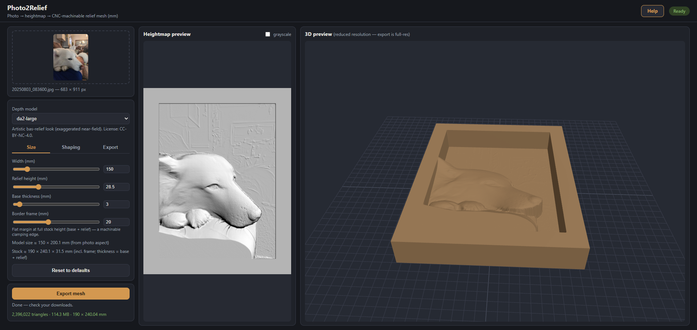

# Photo2Relief

Turn a single 2D photograph into a CNC-machinable 2.5D relief mesh. Locally hosted, Docker-based web app: upload a photo, tune the relief interactively with live 2D/3D previews, export a watertight binary STL (or OBJ) in millimeters, and import it straight into Autodesk Fusion for CAM.

Under the hood: monocular depth estimation (Depth Anything family) → heightmap shaping → grid-triangulated solid mesh. No cloud, no accounts, no paid licenses. See `SPEC.md` for the full design; `CLAUDE.md` for build conventions and status.

> **Status:** v1.0 — released. Built milestone-by-milestone per `SPEC.md`; see `CLAUDE.md` for the build log and decisions.



## Quick start

Prerequisites: Docker + Docker Compose. For GPU mode (recommended): an NVIDIA GPU and the [NVIDIA Container Toolkit](https://docs.nvidia.com/datacenter/cloud-native/container-toolkit/latest/install-guide.html).

The fastest path pulls a **pre-built image** from GitHub Container Registry — no clone, no local files, one command:

```bash
# GPU (recommended — pulls the CUDA image, reserves your NVIDIA GPU)
docker run -d --name photo2relief --pull always --gpus all -p 127.0.0.1:8090:8090 -e P2R_DEVICE=auto -v photo2relief-models:/srv/data/models -v photo2relief-sessions:/srv/data/sessions ghcr.io/potatovibes/photo2relief:latest-gpu

# CPU (portable; auto-selects the lightweight model, no NVIDIA toolkit needed)
docker run -d --name photo2relief --pull always -p 127.0.0.1:8090:8090 -e P2R_DEVICE=cpu -v photo2relief-models:/srv/data/models -v photo2relief-sessions:/srv/data/sessions ghcr.io/potatovibes/photo2relief:latest
```

Open **http://localhost:8090**. First run downloads the default depth model (one-time, ~1–2 GB, cached in the `photo2relief-models` volume); after that the app works fully offline. Confirm the device with `curl http://localhost:8090/api/health` (expect `"device":"cuda"` in GPU mode). Stop and remove with `docker rm -f photo2relief` — your models and sessions persist in the named volumes.

> On Windows PowerShell the command above works as a single line. If you split it across lines, use a backtick (`` ` ``) at each line end, not the `\` shown in Bash examples.

### Manage it with Docker Compose instead

If you have the repo cloned, the `.ghcr` compose files give you the same pull-based run with `down` to stop, config visible in one place, and named-service management:

```bash
# from the repo root:
docker compose -f docker-compose.ghcr.yml -f docker-compose.gpu-ghcr.yml up -d   # GPU
docker compose -f docker-compose.ghcr.yml up -d                                  # CPU
```

These write model/session data to `./data/` (relative to the repo) rather than Docker-managed volumes. Stop with the same command + `down` instead of `up -d`. Pin a specific release by setting `P2R_TAG` (e.g. `P2R_TAG=1.0.0`); port and other settings are env-configurable — see the compose files.

### Build from source instead

To build the image locally (for development, or to run un-published changes), use the `docker-compose.yml` / `docker-compose.gpu.yml` pair with `--build`:

```bash
# GPU
docker compose -f docker-compose.yml -f docker-compose.gpu.yml up --build

# CPU
docker compose up --build
```

`--build` here forces a rebuild so your local changes take effect; without it Compose reuses a previously built image. (The `.ghcr` compose files above never build — they only pull.)

### Published image variants

| Image | For | Notes |
|---|---|---|
| `ghcr.io/potatovibes/photo2relief:latest` | **CPU** | Portable, smaller. **Multi-arch (amd64 + arm64)** — runs natively on Apple Silicon Macs. Auto-selects the lightweight DA2-Small model. |
| `ghcr.io/potatovibes/photo2relief:latest-gpu` | **NVIDIA GPU** | amd64 only. CUDA stack + the DA3MONO worker baked in. Multi-GB image; needs the [NVIDIA Container Toolkit](https://docs.nvidia.com/datacenter/cloud-native/container-toolkit/latest/install-guide.html). |

Each tagged release also publishes pinned tags (`:1.0.0`, `:1.0.0-gpu`). The `-gpu` tag only means the CUDA stack is *baked in* — it still needs a GPU host to use it, and falls back to CPU otherwise. To pin a release with the `docker run` command above, swap `:latest-gpu` / `:latest` for the pinned tag.

### Running on an Apple Silicon Mac (M1/M2/M3/M4)

You have two options. **For GPU acceleration, run natively — not in Docker** (Docker on macOS can't reach the Metal GPU):

```bash
uv sync --extra cpu                                 # installs arm64 CPU/Metal torch
uv run uvicorn app.main:app --port 8090             # P2R_DEVICE defaults to "auto" -> picks MPS
```

`GET /api/health` will report `"device":"mps"`. The M-series GPU (MPS) makes depth roughly **9–10× faster** than CPU (measured on an M3: DA2-Large ~28 s → ~3 s at 12 MP). The default model on MPS is **DA2-Large**. DA3MONO is not available on Mac and selecting it fails with a clear message. If MPS ever misbehaves, `P2R_DEVICE=cpu uv run uvicorn …` forces CPU.

The Docker path (the multi-arch CPU image above) also runs natively on Apple Silicon, but is **CPU-only** — use it for portability; use the native run for speed.

## Security & scope

This is a **single-user, unauthenticated tool meant to run on your own machine.** There are no accounts or access control — anyone who can reach the port can upload images, run compute, and download meshes. Treat it like a local dev server:

- Both the `docker run` command and the compose files bind the port to **`127.0.0.1` (localhost only)** by default, so nothing is exposed to your network out of the box. That's deliberate — keep it that way.
- **Do not** port-forward it or put it on a public IP as-is. If you genuinely need remote/LAN access, put an authenticating reverse proxy (or at least HTTP basic auth) in front of it first, and only then change the `127.0.0.1` prefix (in the `-p` flag or in `docker-compose.yml`).
- It has no rate limiting and keeps every uploaded session on disk under `./data/`, so an untrusted caller could fill your disk or saturate your GPU. Fine on localhost; not fine when exposed.

## Using the app

1. **Upload** a JPEG/PNG/WebP/HEIC (up to ~30 MP). Depth estimation runs once and is cached — on the GPU this takes a few seconds.
2. **Tune.** Parameters are grouped as Size / Depth shaping / Surface / Export. The 2D hillshade preview updates instantly; the interactive 3D preview refreshes a moment later. Nothing you do here re-runs the AI model, so twist the knobs freely.
3. **Export.** Generates the full-resolution watertight mesh and downloads it. The filename embeds the physical dimensions in mm.

### Parameter cheat sheet

- **Size:** model width (mm), relief height, base slab thickness, optional flat border frame for clamping.
- **Depth shaping:** depth model selection (see below), invert (intaglio/mold mode), gamma (push the subject forward / flatten the background), percentile clipping, flatten-background threshold.
- **Surface:** smoothing amount, edge-preserving (bilateral) mode, luminance detail blend (adds lithophane-style fine texture — hair, fabric — that depth models smooth over), edge taper.
- **Export:** grid resolution (512/1024/2048 long side), optional decimation, STL or OBJ.

### Choosing a depth model

| Model | Character | Speed | License* |
|---|---|---|---|
| **DA3MONO-Large** (default) | Predicts true depth → most geometrically faithful relief. Best for objects, scenes, pets. Runs in an isolated worker env; ~15 s per new photo (then cached). | Fast on GPU | Apache-2.0 (HF field, 2026-07-18) |
| **Depth Anything V2 Large** | Disparity-style output exaggerates the near field and compresses the background — often the more *artistic* bas-relief look for portraits. | Fast on GPU | CC-BY-NC 4.0 |
| **Depth Anything V2 Small** | Lightweight fallback; the only fully Apache-2.0 option. Auto-selected when no GPU is present. | Fast even on CPU | Apache-2.0 |

*This is a personal, non-commercial tool. The CC-BY-NC-licensed weights are fine for that use; don't redistribute this app with those weights bundled or use outputs commercially without checking the model licenses. The build records each model's license as listed on its Hugging Face page.

Tip: run the same photo through DA3MONO and DA2-Large and compare the hillshades — the "right" one is an aesthetic call and differs by subject.

## Importing into Autodesk Fusion

1. **Insert → Insert Mesh**, select the exported `.stl`.
2. **Set units to millimeters** — STL is unitless and this is the classic gotcha. The correct physical stock size is embedded in the filename as `width × height × thickness` (e.g. `dog_170x220x26mm.stl`, named after your uploaded photo); sanity-check the bounding box after import.
3. Flip/orient as needed; the mesh is a closed solid (relief + base slab), so Fusion's **Manufacture** workspace can toolpath it directly as a mesh body — no BRep conversion required.
4. Typical CAM recipe for wood: 3D Adaptive Clearing with a 1/4" end mill leaving ~0.5 mm stock, then Parallel finishing with a ball nose (1/8" or smaller for fine portraits, ~8–10% stepover). The base slab gives you material to hold in the vise or screw to a spoilboard; add a border frame in the app if you want dedicated clamp real estate.
5. Undercuts are impossible by construction (single-viewpoint relief), so everything is reachable by a 3-axis machine.

## Development (outside Docker)

```bash
uv sync                                  # env + deps (Python 3.12)
uv run uvicorn app.main:app --reload --port 8090
uv run pytest                            # unit tests (fast; model smoke tests are @slow)
uv run pytest -m slow                    # includes one real-inference smoke test
uv run ruff check . && uv run ruff format --check .
```

Layout: `app/` (FastAPI backend — `depth.py` model adapters, `heightmap.py` pure transforms, `meshing.py` mesh build/export), `static/` (vanilla JS + vendored three.js frontend, no build step), `tests/`, `data/` (gitignored: sessions + model cache). Full API contract and architecture: `SPEC.md`.

## Troubleshooting

- **GPU compose fails / falls back to CPU:** confirm `nvidia-smi` works on the host and the NVIDIA Container Toolkit is installed; check `/api/health` — it reports the active device and model.
- **Port conflict:** change the published port in `docker-compose.yml` (container listens per `P2R_PORT`, default 8090).
- **First model download fails:** the container needs internet for the initial Hugging Face fetch only; retry, or pre-populate `./data/models/`.
- **Fusion imports a tiny/huge model:** you imported with the wrong units — re-import as millimeters.

## Licenses

Application code: MIT (or your preference — set before publishing). Third-party: FastAPI/three.js/trimesh et al. are MIT/BSD/Apache. Model weights carry their own licenses per the table above and are downloaded at runtime, not distributed with this repo.
